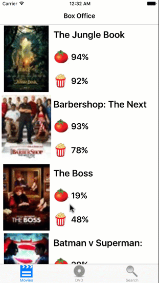

# RottenTomatoes-Xamarin.Forms

This is a movies app displaying box office and top rental DVDs using the [Rotten Tomatoes API](http://developer.rottentomatoes.com/docs/read/JSON).

## Steps to run


- Open the project and add your keys at the View/MainView.xaml.cs.

	```csharp	
	const string apikey = "your key";		
	```
	

## ScreenShot
